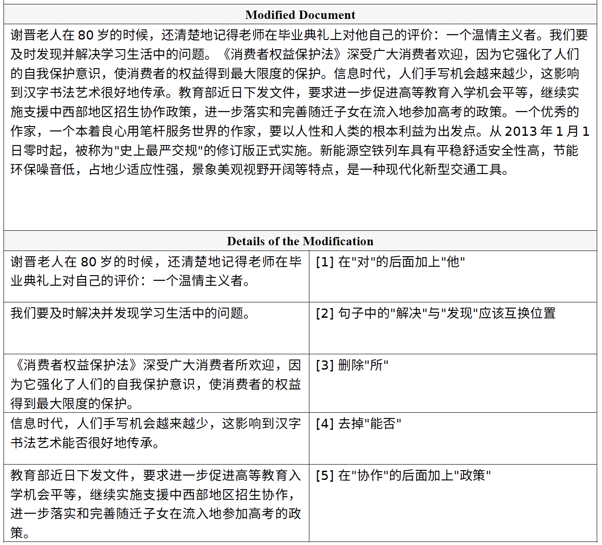

<p align="center" >
    <a href="https://github.com/xlxwalex/FCGEC">
    <br>
    
    <br>
    </a>
</p>
<p align="center">
    <a href="https://github.com/xlxwalex/FCGEC/blob/main/LICENSE">
        
    </a>
</p>

---

# FCGEC: Fine-Grained Corpus for Chinese Grammatical Error Correction
[**中文**](https://github.com/xlxwalex/FCGEC) | [**English**](https://github.com/xlxwalex/FCGEC/blob/main/README_EN.md)

[[***程序更新*** (最近2023/10/27)]](#程序更新信息)&nbsp;&nbsp;&nbsp; [[***语料更新*** (最近2023/11/08)]](#语料更新信息)
## FCGEC介绍
中文语法检错纠错（Chinese Grammatical Detection & Correction, CGED & CGEC）是指给定一个句子，检纠错系统可以检查句子中是否存在语法错误。如果有语法错误，系统需要对错误的文本进行自动纠错并输出正确的句子。
该项技术已被用在教育、检索等多个领域。

近来在数据集以及模型上都有了不少的工作，但是之前的数据集工作主要有三个问题：(1)中文的数据集数量较少。 (2)中文纠错数据主要集中在汉语水平考试 (HSK) 等来源，因此语料库包含的主要是非中文母语使用(Chinese as a Foreign Language, CFL) 者的错误数据，而母语使用者的语法错误要更具挑战性。 (3) 纠错的方式单一，往往只有一种修改方式 (修改答案)。


基于以上这些问题，我们的FCGEC旨在提供一个大规模母语使用者的多参考文本纠检错语料，用于训练以及评估纠检错模型系统。除此之外，在这个工作中我们提出了一种基于编辑的（Switch-Tagger-Generator, STG）模型作为基准，希望能为CGEC社区做出贡献。

## FCGEC语料
我们的数据来源主要是小初高中学生的病句试题以及新闻聚合网站，为了给句子更多的参考修改方式来达成多样化的标注目标，每一个句子会被随机分配给2-4个标注者进行标注。我们从两个数据来源中收集到了54,026个原始句子，经过去重和筛选掉问题句(如文本截断等)后FCGEC共包含41,340个句子。数据的统计信息如下表所示：

 数据集 | 数据来源| 句子总数 | 错误句子数(%) | 平均长度 | 平均参考数 | 
| :------- | :---------: | :---------: | :---------: | :---------: | :---------: | 
| **FCGEC** | `Native` | 41340 | 22517 (54.47%) | 53.1 | 1.7 | 

我们将这些数据分成了训练集，验证集和测试集，它们的数量分别为：36340， 2000以及3000，其他更多详细的数据请参见我们的论文。

### FCGEC语料数据
FCGEC的训练、验证及测试数据都已放在[`data`](https://github.com/xlxwalex/FCGEC/tree/main/data) 目录下，数据的格式请见 [`data`](https://github.com/xlxwalex/FCGEC/tree/main/data) 下的README文件。注意：测试集我们只给出了句子没有给出对应的标签，您可以通过该[Codalab评测页面](https://codalab.lisn.upsaclay.fr/competitions/8020) 提交您的模型预测结果来计算性能。

### 语料更新信息
+ (2022/12/07 勘误) 感谢`nghuyong`的反馈([ISSUE#6](https://github.com/xlxwalex/FCGEC/issues/6))，`FCGEC_train.json`(1023)版本存在问题，该版本为中间过程语料被错误上传(有部分样本存在`error_flag`错误，以及缺少所有的正确句子样本)，目前该文件已重新上传
+ (2023/01/25 更新) 解决了`FCGEC_train.json`(1207)版本中特殊符号、空格可能引起程序报错的问题，并修复了部分Switch操作标签序列重复的问题
+ (2023/07/27 勘误) 感谢`KingiLuther`的反馈([ISSUE#22](https://github.com/xlxwalex/FCGEC/issues/22))，修复了训练集中两个样本错误类型标注有误的问题
+ (2023/11/08 更新) 感谢`JamyDon`的反馈([ISSUE#26](https://github.com/xlxwalex/FCGEC/issues/26))，之前版本的训练集、验证集以及测试集之间存在同源句子，会造成数据泄露问题。我们提供了一个新的[`FCGEC_train_filtered.json`](https://github.com/xlxwalex/FCGEC/tree/main/data/FCGEC_train_filtered.json)文件，过滤掉了训练集中与验证、测试集中同源的句子

## FCGEC任务
我们的语料共有三种标签对应于纠检错的三个任务，分别如下：
+ ***错误检测 (error detection)：*** 模型需要判断给定的句子是否包含语法错误 (二分类任务)
+ ***类型检测 (type identification)：*** 模型需要判定句子中的语法错误属于七种错误类型中的哪一种，错误类型分别为：
    1. 语序不当 (Incorrect Word Order, IWO)
    2. 搭配不当 (Incorrect Word Collocation, IWC)
    3. 成分缺失 (Component Missing, CM)
    4. 成分赘余 (Component Redundancy, CR)
    5. 结构混乱 (Structure Confusion, SC)
    6. 不合逻辑 (Illogical, ILL)
    7. 语意不明 (Ambiguity, AM)
+ ***文本纠错 (error correction)：*** 给定一个句子，模型输出对应的无语法错误句子

关于以上任务，更多详细的信息以及实例请参考我们的论文。

## STG纠错模型
对于FCGEC的纠错任务，我们提出了STG (Switch-Tagger-Generator)模型，如下图所示。其由三个模块组成：
+ `Switch`模块：利用指针网络来确定句子中字符序列的顺序
+ `Tagger`模块：预测纠错需要对每个字符进行操作 (保持-KEEP， 删除-DELETE， 插入-INSERT， 修改-MODIFY)，并且对于插入和修改操作还需要确定操作的字符的数量T
+ `Generator`模块：当涉及INSERT以及MODIFY这样需要改变字符的操作时，利用预训练模型的MLM方式来生成字符

***注意：*** 我们的STG模型各个模块之间可以自由的`独立`或`联合`训练，但是在推断时是以Pipeline的形式进行的

<p align="center">
    <br>
    
    <br>
</p>
<p align="center">
    <br>
    STG模型示意图
    <br>
</p>
在STG模型的基础上，我们发现由于错误类型与我们设计的几种操作关系有很大的相关性，因此检错任务可以通过将错误类型判断作为辅助任务来提升纠错的性能，也就是论文中的(+TTI)。更多关于模型的信息可以参考我们的论文。

### 实验环境搭建
我们采用Python=3.8.5作为基本环境，您可以通过以下代码来创建环境以及安装依赖：
```shell
conda create -n stg_env python=3.8.5
source activate stg_env
pip install -r requirements.txt
```

### 训练及测试
STG模型训练-测试bash文件共有三个：[`run_stg_indep.sh`](https://github.com/xlxwalex/FCGEC/blob/main/model/STG-correction/run_stg_indep.sh) , [`run_stg_tti.sh`](https://github.com/xlxwalex/FCGEC/blob/main/model/STG-correction/run_stg_tti.sh) 以及[`run_stg_joint.sh`](https://github.com/xlxwalex/FCGEC/blob/main/model/STG-correction/run_stg_joint.sh) ，分别对应论文中的`STG-Indep`，`STG-Indep+TTI`以及`STG-Joint`。具体细节可参考 `model/STG-correction/run_stg_indep.sh`，`model/STG-correction/run_stg_tti.sh`和`model/STG-correction/run_stg_joint.sh`。

***注意***：请在使用脚本前将[`data`](https://github.com/xlxwalex/FCGEC/tree/main/data) 目录下的三个json数据集放到程序目录中的`dataset`下。另外您需要在使用前先配置bash文件头部的参数：
```shell
CUDA_ID=   
SEED=                               # 随机数种子
EPOCH=     
BATCH_SIZE=  
MAX_GENERATE=                       # MAX T (最大生成字符数，一般设为6即可，若使用下方checkpoint[版本221021]请设为5)
SPECIAL_MAPPING=                    # 是否对标点/英文等做映射，更多信息请见ISSUE #10 (为了与论文中结果一致，默认不开启)
CHECKPOINT_DIR=checkpoints
PLM_PATH=                           # 预训练模型路径
OUTPUT_PATH=                        # 测试集预测输出.xlsx文件位置
```

### 程序更新信息
+ (2022/11/29) 感谢`GMago123`的反馈([ISSUE#3](https://github.com/xlxwalex/FCGEC/issues/3)) ，为了便于提交评测，我们在Joint的输出XLSX文件中加入了对应的UID字段
+ (2022/12/06) 感谢`谭*环`(邮件)的建议，为了方便对比Seq2Seq类型的模型，我们提供了可将FCGEC数据的编辑操作转换为序列到序列数据的脚本[convert_fcgec_to_seq2seq.py](https://github.com/xlxwalex/FCGEC/blob/main/model/STG-correction/scripts/convert_fcgec_to_seq2seq.py) ，使用方式请见[`scripts`](https://github.com/xlxwalex/FCGEC/tree/main/model/STG-correction/scripts) 下的README文件 
+ (2023/01/25) 感谢`Candice52`的反馈([ISSUE#7](https://github.com/xlxwalex/FCGEC/issues/7))，我们提供了将其他Seq2Seq格式的数据转换为本工作中的操作格式的脚本(论文中的Algorithm 1代码) [convert_seq2seq_to_operation.py](https://github.com/xlxwalex/FCGEC/blob/main/model/STG-correction/scripts/convert_seq2seq_to_operation.py) ，使用方式请见[`scripts`](https://github.com/xlxwalex/FCGEC/tree/main/model/STG-correction/scripts) 下的README文件 
+ (2023/03/03) 感谢Helenailse1`的建议([ISSUE#10](https://github.com/xlxwalex/FCGEC/issues/10))，我们新增了对标点、字母等非中文符号的映射
+ (2023/04/24) 增加新特性`Reporter`，程序可以导出病句报告，详细信息请见[`app`](https://github.com/xlxwalex/FCGEC/blob/main/model/STG-correction/app)下的README文件以及[ISSUE#15](https://github.com/xlxwalex/FCGEC/issues/15)，DEMO使用代码见[`demo_pipeline.py`](https://github.com/xlxwalex/FCGEC/blob/main/model/STG-correction/demo_pipeline.py)，[DEMO报告](https://github.com/xlxwalex/FCGEC/blob/main/model/STG-correction/dataset/demo/demo-v1.0.pdf)截图如下所示：
  <details>
  <summary>展开查看截图</summary>
  <p align="center">
    <br>
    
    <br>
  </p>
  </details>
+ (2023/04/25) 感谢`yuan-cherish`的建议([ISSUE#15](https://github.com/xlxwalex/FCGEC/issues/15))，我们新增了单句推理改错的脚本[inference_singleline.py](https://github.com/xlxwalex/FCGEC/blob/main/model/STG-correction/inference_singleline.py)，运行后直接输入错误句子，会返回修改后的句子(输入`q`退出)
+ (2023/04/25) 感谢`Lj4040`的反馈([ISSUE#11](https://github.com/xlxwalex/FCGEC/issues/11))，我们修复了JointLoss中生成器可能损失为NaN的问题以及Indep模式下Generator过滤掉了有效样本的问题（可能会提升Indep模型的表现)
+ (2023/10/27) 感谢`yanghh2000`的反馈([ISSUE#24](https://github.com/xlxwalex/FCGEC/issues/24))，我们修复了[convert_fcgec_to_seq2seq.py](https://github.com/xlxwalex/FCGEC/blob/main/model/STG-correction/scripts/convert_fcgec_to_seq2seq.py)插入句首引起的错位问题)

### 模型参数文件
我们提供在FCGEC语料上训练好的模型checkpoint文件，以方便大家使用测试：

| 模型名称 | 预训练模型 | 模型性能(EM/F0.5) | 下载链接 | 版本 |
| :------- | :---------: | :---------: | :---------: | :---------: | 
| **FCGEC-Joint** | [`RoBERTa-Base-Chinese`](https://huggingface.co/hfl/chinese-roberta-wwm-ext) | 34.10 / 45.48 | [FCGEC_checkpoints.pt](https://expic.xlxw.org/fcgec/checkpoints.pt) | `221021`

***使用方式：*** 您可以将该checkpoint文件放到[`model/STG-correction/checkpoints`](https://github.com/xlxwalex/FCGEC/tree/main/model/STG-correction/checkpoints) 文件夹中，之后使用[`joint_evaluate.py`](https://github.com/xlxwalex/FCGEC/blob/main/model/STG-correction/joint_evaluate.py) 文件来得到测试集的预测结果，具体使用方式可以参考[`run_stg_joint.sh`](https://github.com/xlxwalex/FCGEC/blob/main/model/STG-correction/run_stg_joint.sh) 的 `STEP 3`部分 (***注意***：如果您使用该checkpoint，请将`MAX_GENERATE`设置为5进行使用，具体请见 [ISSUE#3](https://github.com/xlxwalex/FCGEC/issues/3) ，感谢`GMago123`的反馈)。

***下载常见问题***： 如果点击checkpoint文件链接出现403提示，您可以刷新一下网页 或 复制链接并开启一个浏览器新空白页来访问链接，这两种方式一般都可以触发浏览器的下载操作。如果都不行的话您也可以复制checkpoint文件链接到下载器中进行下载。若以上方式都无法解决，欢迎在Issue中进行反馈。

## 模型性能评测
对于***错误检测*** 以及***错误类型检测*** 两个任务，我们采用`Accuracy`, `Precision`, `Recall` 以及 `Macro F1 score` 作为衡量模型性能的依据。

对于***文本纠错任务***，我们采用了`Exact Match`以及`character-level edit metric` ([MuCGEC](https://github.com/HillZhang1999/MuCGEC) 中提出)作为评价指标。

更详细的内容请见 [`scorer`](https://github.com/xlxwalex/FCGEC/tree/main/scorer) 目录下的README文件。

### 在线评测页面
我们的测试集不直接提供三个任务的标签，因此您需要通过在线评测页面的形式提交您模型在测试集上的预测结果，我们会自动计算您模型的性能指标并在Leaderboard上展示（可选匿名）。我们将评测页面部署在了`Codalab`上并永久开放，您可以通过下方链接进行访问：
<p align="center">
    <a href="https://codalab.lisn.upsaclay.fr/competitions/8020">
        
    </a>
</p>

## 引用
如果您使用了我们的数据或者认为我们的工作对您有帮助，您可以引用我们的论文：
***FCGEC: Fine-Grained Corpus for Chinese Grammatical Error Correction***
```
@inproceedings{xu2022fcgec,
    title = "{FCGEC}: Fine-Grained Corpus for {C}hinese Grammatical Error Correction",
    author = "Xu, Lvxiaowei  and
      Wu, Jianwang  and
      Peng, Jiawei  and
      Fu, Jiayu  and
      Cai, Ming",
    booktitle = "Findings of the Association for Computational Linguistics: EMNLP 2022",
    year = "2022",
    publisher = "Association for Computational Linguistics",
    url = "https://aclanthology.org/2022.findings-emnlp.137",
    pages = "1900--1918"
}
```
<p align="center">
    <a href="https://arxiv.org/abs/2210.12364">
        
    </a>
</p>

## 相关数据集工作
+ MuCGEC评测数据集：[MuCGEC](https://github.com/HillZhang1999/MuCGEC/)
+ YACLC评测语料库：[YACLC](https://github.com/blcuicall/YACLC)
+ NLPCC18纠错数据集：[NLPCC18](https://github.com/zhaoyyoo/NLPCC2018_GEC)
+ CTC2021评测比赛：[CTC-2021](https://destwang.github.io/CTC2021-explorer/)

## 数据使用条件
通过下载数据或以任何方式访问FCGEC数据，您同意仅将数据用于`非商业`和`学术研究`目的。除此之外，这些数据不得用于任何`非法`或`歧视性`的目的。

## 联系我们
1. 如果您对数据/代码有任何问题，可以提交Issue或联系 [`xlxw@zju.edu.cn`](mailto:xlxw@zju.edu.cn)
2. 如果您在使用评测页面有任何问题，可以联系[`pengjw@zju.edu.cn`](mailto:pengjw@zju.edu.cn)，推荐您在联系时顺便抄送一份给[`xlxw@zju.edu.cn`](mailto:xlxw@zju.edu.cn)
