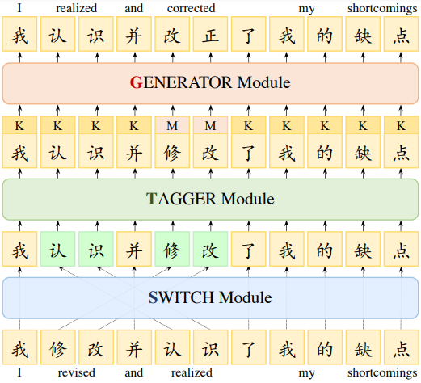

<p align="center" >
    <a href="https://github.com/xlxwalex/FCGEC">
    <br>
    
    <br>
    </a>
</p>
<p align="center">
    <a href="https://github.com/xlxwalex/FCGEC/blob/main/LICENSE">
        
    </a>
</p>

---

# FCGEC: Fine-Grained Corpus for Chinese Grammatical Error Correction
[**中文**](https://github.com/xlxwalex/FCGEC) | [**English**](https://github.com/xlxwalex/FCGEC/blob/main/README_EN.md)

## Introduction
Chinese Grammatical Detection & Correction (CGED & CGEC) is a natural language processing sub-field. Given a sentence, the error detection and correction system can determine whether there are grammatical errors in the sentence. If there are grammatical errors in the sentence, the system needs to automatically correct the erroneous text and output the correct sentence.
This technology has been used in various fields such as education and retrieval, .etc.

There has a lot of valuable work on datasets and models recently, but previous works on datasets have three main obstacles: 

(1) The major obstacle in CGEC is that the high-quality manually annotated data is limited compared to other languages. 

(2) The sentences in pervious dataset are all collected from Chinese as a Foreign Language (CFL) learner sources. However, massive errors from native speakers rarely arise in these sources. Therefore, the native speaker errors are more challenging with the inclusion of pragmatic data.

(3) The samples in the datasets are often with only one type of revision (ground truth).

To tackle aforementioned obstacles, we present FCGEC, a large-scale fine-grained GEC corpus with  multiple  references. Besides, we propose Switch-Tagger-Generator (STG) model as an effective baseline to correct grammatical errors in low-resource settings.

## FCGEC Corpus
Our data sources are mainly examination questions from elementary, middle and high school students and news aggregation websites. In order to provide more reference modifications to the sentences to achieve diverse annotation goals, each sentence is randomly assigned to 2 to 4 annotators for annotation. 
We collect 54,026 raw sentences from the two data sources, and after de-duplicating and filtering out problematic sentences (e.g., text truncation, etc.), FCGEC contains 41,340 sentences in total. The statistical information of the data is shown in the following table:

 Corpus | Source| Sentences | #Error(%) | Avg. Length | Avg. Reference | 
| :------- | :---------: | :---------: | :---------: | :---------: | :---------: | 
| **FCGEC** | `Native` | 41340 | 22517 (54.47%) | 53.1 | 1.7 | 

We divide these data into train, validation and test sets with the numbers 36340, 2000 and 3000 respectively.
And more detailed statistics are available in our paper.
### How to Access FCGEC
The train, validation and test data for our FCGEC are placed in the [`data`](https://github.com/xlxwalex/FCGEC/tree/main/data) directory, the format of the data can be found in the README file.

***Note:*** For the test set we only provide the sentences without the corresponding labels, which you can evaluate your model by visiting [Codalab Page](https://codalab.lisn.upsaclay.fr/competitions/8020) to calculate the performances.

## FCGEC Tasks
Our corpus has three types of labels corresponding to the three tasks for error correction and detection, as follows.
+ ***Error Detection:*** The model needs to determine whether the given sentence contains grammatical errors. (Binary Classification)
+ ***Type Identification:*** The model needs to identify which of the seven error types the grammatical error in the sentence belongs to, and the error types are：
    1. Incorrect Word Order (IWO)
    2. Incorrect Word Collocation (IWC)
    3. Component Missing (CM)
    4. Component Redundancy (CR)
    5. Structure Confusion (SC)
    6. Illogical (ILL)
    7. Ambiguity (AM)
+ ***Error correction:*** Given a sentence, the model outputs the corresponding sentence without grammatical errors。

For more detailed information about the above tasks and examples, please refer to our paper.

## STG Model
For the error correction task of FCGEC, we propose the STG (Switch-Tagger-Generator) model, as shown in the following figure. It consists of three modules:
+ `Switch` Module: Determine the order of the sequence of characters in a sentence via pointer network.
+ `Tagger`Module: Predict the operation on each character for error correction (KEEP, DELETE, INSERT, MODIFY).And for INSERT and MODIFY operations, the module need to identify the number of characters (T) to be inserted or substituted
+ `Generator`Module: When it comes to operations like INSERT and MODIFY that require changing characters, we can apply MLM to generate new characters via the pre-trained models

***Note:*** The modules of our STG model are independent to each other, so they can train `independently` or `jointly`. However, the inference phase is conducted in the form of Pipeline fashion.

<p align="center">
    <br>
    
    <br>
</p>
<p align="center">
    <br>
    The architecture of our STG model
    <br>
</p>
we found that the error type is highly correlated with several operations we designed. Thus, the error type identification task can improve the performance of error correction by utilizing error type identification task as a auxiliary task, i.e. the (+TTI) paradigm in our paper.
More information about the model can be found in our paper.

### Experimental environment setup
We adopt `Python=3.8.5` as the base environment, You can create the environment and install the dependencies with the following code:
```shell
conda create -n stg_env python=3.8.5
conda activate stg_env
pip install -r requirements.txt
```

### Training and Testing
The bash files for training-testing STG model contain：[`run_stg_indep.sh`](https://github.com/xlxwalex/FCGEC/blob/main/model/STG-correction/run_stg_indep.sh) , [`run_stg_tti.sh`](https://github.com/xlxwalex/FCGEC/blob/main/model/STG-correction/run_stg_tti.sh) and [`run_stg_joint.sh`](https://github.com/xlxwalex/FCGEC/blob/main/model/STG-correction/run_stg_joint.sh) correspond to `STG-Indep`,`STG-Indep+TTI`and`STG-Joint`. Specific details can be found in `model/STG-correction/run_stg_indep.sh`, `model/STG-correction/run_stg_tti.sh` and `model/STG-correction/run_stg_joint.sh`.

***Note***: Please configure the parameters in the head of the bash file before running：
```shell
CUDA_ID=   
SEED=                               # Random seed
EPOCH=     
BATCH_SIZE=  
MAX_GENERATE=                       # MAX T (Maximum number of characters generated, default set to 6)
CHECKPOINT_DIR=checkpoints
PLM_PATH=                           # Pre-trained model path
OUTPUT_PATH=                        # Prediction output of .xlsx file for STG model
```

## Model Evaluation
For ***Error Detection*** and ***Type Identification*** tasks, We adopt `Accuracy`, `Precision`, `Recall` and `Macro F1 score` as the metric to evaluate the performances of the models.

For ***Error correction***，We apply `Exact Match` and `character-level edit metric` (proposed in [MuCGEC](https://github.com/HillZhang1999/MuCGEC) ) as the evaluating metrics.

Mor details can be found in the README file from [`scorer`](https://github.com/xlxwalex/FCGEC/tree/main/scorer) .

### Online Evaluation
Our test set does not provide labels for the three tasks directly, so you will need to submit your predictions of your models in the form of an online review page to get the model performance metrics
. We deploy the evaluation page on `Codalab` and open permanently, you can access it through the link below:
<p align="center">
    <a href="https://codalab.lisn.upsaclay.fr/competitions/8020">
        
    </a>
</p>

## How to cite
If you are using our code or data, please cite our paper: 
***FCGEC: Fine-Grained Corpus for Chinese Grammatical Error Correction***
```
@inproceedings{xu2022fcgec,
  author = {Lvxiaowei Xu and Jianwang Wu and Jiawei Peng and Jiayu Fu and Ming Cai},
  title = {FCGEC: Fine-Grained Corpus for Chinese Grammatical Error Correction},
  booktitle = {Findings of the Association for Computational Linguistics: EMNLP 2022},
  year = {2022}
}
```
<p align="center">
    <a href="https://arxiv.org/abs/2210.12364">
        
    </a>
</p>

## Related work
+ MuCGEC Dataset：[MuCGEC](https://github.com/HillZhang1999/MuCGEC/)
+ YACLC Dataset：[YACLC](https://github.com/blcuicall/YACLC)
+ NLPCC18 Dataset：[NLPCC18](https://github.com/zhaoyyoo/NLPCC2018_GEC)
+ CTC2021 Competition：[CTC-2021](https://destwang.github.io/CTC2021-explorer/)

## Terms and Conditions
By downloading the data or by accessing it any manner, you agree not to redistribute the data. Our data can only used for non-commercial and academic-research purposes. The data must not be used for any unlawful or discriminatory purpose.

## Hwo to Contact Us
1. If you have any questions about the data / code, feel free to submit an Issue or contact [`xlxw@zju.edu.cn`](mailto:xlxw@zju.edu.cn)
2. If you have any questions about the evaluation page, you can contact [`pengjw@zju.edu.cn`](mailto:pengjw@zju.edu.cn)
